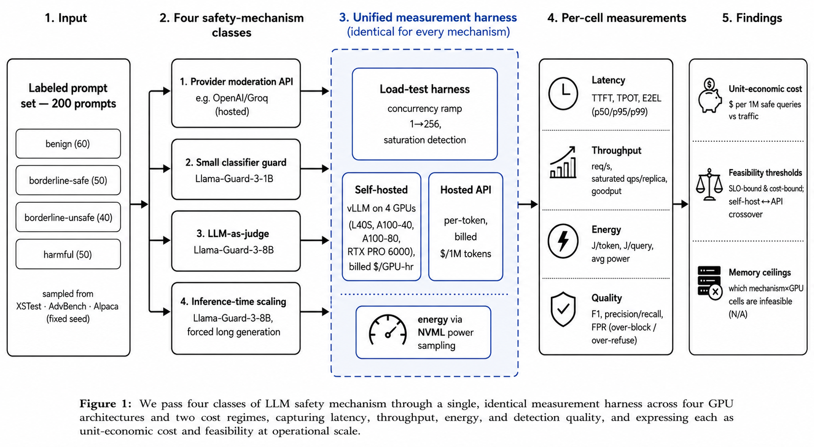

# On the Same Ruler: Latency, Throughput, Energy, and Unit-Economic Cost of LLM Safety Mechanisms at Operational Scale

Measurement study and reproducible harness for comparing the **operational cost** of LLM input--output safety mechanisms. We pass three classes of self-hosted mechanism --- a small classifier guard, an LLM-as-judge, and an inference-time-scaling (forced long-generation) configuration --- through one identical measurement harness across four GPU architectures, and express the results as **unit-economic cost** (USD per million safe queries) and **feasibility** under an interactive latency target.

This repository contains the harness, the labelled prompt set with provenance, the per-GPU measurements, the analysis pipeline, and the paper source.

---

## Repository structure

```
.
├── README.md
├── scripts/                 # measurement + analysis pipeline
│   ├── build_promptset.py   # build labelled prompt set (XSTest/AdvBench/Alpaca)
│   ├── sweep.py             # concurrency-ramp sweep -> qps, latency, energy
│   ├── eval_quality.py      # detection F1 / precision / recall / FPR
│   ├── api_probe.py         # hosted-API latency + $/query (optional regime)
│   ├── aggregate.py         # per-cell JSON -> measured_constants.py + table
│   ├── make_figures.py      # Fig 1-4 + feasibility table
│   ├── pilot_cost_model.py  # scale-parameterised cost curves
│   └── run_matrix.sh        # serve vLLM + sweep across a GPU (per-box driver)
│
├── GPUs/                    # raw per-GPU sweep outputs (one subfolder per card)
│   ├── L40S/                #   results/*.json from that GPU
│   ├── A100_40GB/
│   ├── A100_80GB/
│   └── RTX_PRO_6000/
│
├── main_results/            # merged, analysis-ready outputs
│   ├── results/             #   all per-cell JSON from every GPU + quality_*.json
│                            #   fig1_cost_vs_scale, fig2_saturation,
│                            #   fig3_energy, fig4_pareto (.pdf/.png)
│
├── Paper/                  
│   ├── custom.bib           # references used in literature review
│          
│
└── prompts/
    ├── prompts_labeled.tsv      # need to run notebook to get this file
    
```

---

## Mechanisms and hardware

| Class | Model | Output | Notes |
|---|---|---|---|
| Small classifier guard | Llama-Guard-3-1B | short verdict | `--max-tokens 16` |
| LLM-as-judge | Llama-Guard-3-8B | short verdict | `--max-tokens 16` |
| Inference-time scaling | Llama-Guard-3-8B | long generation | `--max-tokens 600 --force-generate` |

GPUs profiled: **L40S, A100-40GB, A100-80GB, RTX PRO 6000.**

---



*Figure 1: We pass classes of LLM safety mechanisms through a single, identical measurement harness across four GPU architectures, capturing latency, throughput, energy, and detection quality, and expressing each as unit-economic cost and feasibility at operational scale.*

## Reproduction

The pipeline runs in a strict dependency order. Steps 2 are per-GPU; steps 3--6 run once over the merged results.

### 0. Prerequisites
- vLLM (record the exact version; it determines throughput)
- `aiohttp`, `pynvml`, `matplotlib`, `numpy`
- A Hugging Face token with access to the gated Llama-Guard models
- Pre-cache model weights **before** renting GPU time

### 1. Build the prompt set (no GPU, run once)
```bash
mkdir -p prompts/promptset
# download XSTest / AdvBench / Alpaca into prompts/promptset/ (see script header)
python scripts/build_promptset.py
```

### 2. Per-GPU measurement (run on each GPU box)
Serve a model, then sweep. Disable the FlashInfer JIT sampler to avoid a
startup compile that needs CUDA dev headers:
```bash
export VLLM_USE_FLASHINFER_SAMPLER=0
export VLLM_ATTENTION_BACKEND=FLASH_ATTN

# serve (example: 8B judge)
python -m vllm.entrypoints.openai.api_server \
  --model meta-llama/Llama-Guard-3-8B --served-model-name guard8b \
  --port 8000 --max-model-len 2048 --gpu-memory-utilization 0.90 --enforce-eager

# in a second shell on the SAME host (localhost keeps network latency out):
python scripts/sweep.py --gpu L40S --model guard8b --base-url http://localhost:8000 \
  --prompts prompts/prompts_labeled.tsv --max-tokens 16 --rung-seconds 20 --outdir results
python scripts/sweep.py --gpu L40S --model guard8b --base-url http://localhost:8000 \
  --prompts prompts/prompts_labeled.tsv --max-tokens 600 --rung-seconds 20 \
  --outdir results --force-generate
```
Repeat for `guard1b` (relaunch vLLM with `Llama-Guard-3-1B` / `guard1b`).
Run `eval_quality.py` **once per model** (quality is hardware-independent):
```bash
python scripts/eval_quality.py --model guard8b --base-url http://localhost:8000 \
  --prompts prompts/prompts_labeled.tsv --max-tokens 64 --concurrency 8 --outdir results
```

Per GPU you produce four sweep files; collect each card's `results/` into `GPUs/<card>/`.

### 3. Merge
Copy all per-GPU JSON (plus the two `quality_*.json`) into `main_results/results/`.

### 4--6. Analyse (no GPU, run once)
```bash
cd main_results
python ../scripts/aggregate.py      # -> measured_constants.py, feasibility table
python ../scripts/make_figures.py   # -> figures/
python ../scripts/pilot_cost_model.py
```

---

## Key result

Across 16 mechanism×hardware configurations, the unit-economic cost floor spans
**\$0.80 to \$65.62 per million safe queries**. The separation is driven chiefly
by **output length, not model size**: forcing long generation reduces serving
capacity by **28--77×** on identical hardware and is **infeasible under an
interactive latency target**. Raw saturated throughput overstates deployable
capacity; the SLO-respecting operating point lies below saturation.

---

## Notes on reproducibility
- **Serving stack matters.** Throughput is specific to the vLLM version and launch
  flags; report them. Numbers here use eager execution, `max-model-len 2048`, and
  the Torch-native sampler (FlashInfer JIT disabled).
- **Energy** is on-device GPU power via NVML, integrated to joules; run on
  dedicated GPUs so readings aren't polluted by co-tenants.
- **Forced long generation** produces meaningless content by design; that cell
  measures the *cost* of long decoding, not output quality.
- **Prompt set** is sampled with a fixed seed for byte-identical reproduction.

## Data and licensing
Prompts are sampled from XSTest (CC-BY-4.0), AdvBench, and Alpaca. Unsafe prompts
are used only as classifier inputs; no harmful content is generated.

## Citation
```bibtex
@inproceedings{ontheruler,
  title     = {On the Same Ruler: Latency, Throughput, Energy, and Unit-Economic
               Cost of LLM Safety Mechanisms at Operational Scale},
  author    = {Author},
  year      = {2026}
}
```
